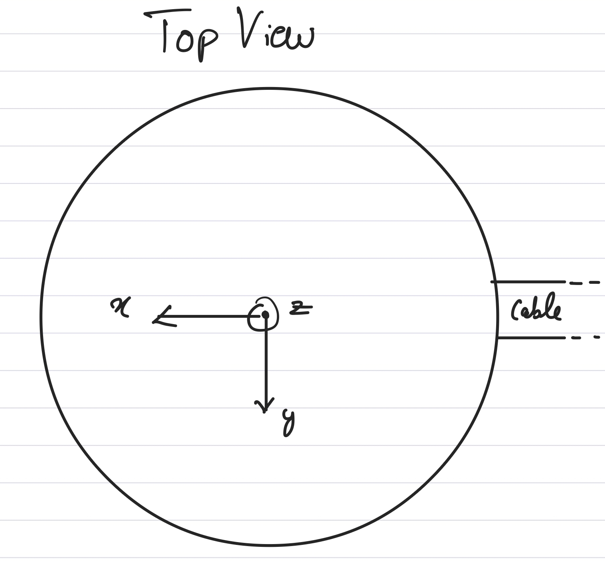

# Repos for Lidar-Camera Calibration

I tried two repositories for calibration: targetless (extended_lidar_calib) and target based (velo2cam).
The target based method needs a large target and is bit more tricky to run and I focused on the targetless method

# Targetless Calibration

The detailed steps to run the calibration is found the in the respective package. Only the
results are shown here.

### Pointcloud with Edge Detections

### Initial and Rough Optimization Results

# Final Results

# Coordinate Frames for Reference

**RealSense**

**VLP**

