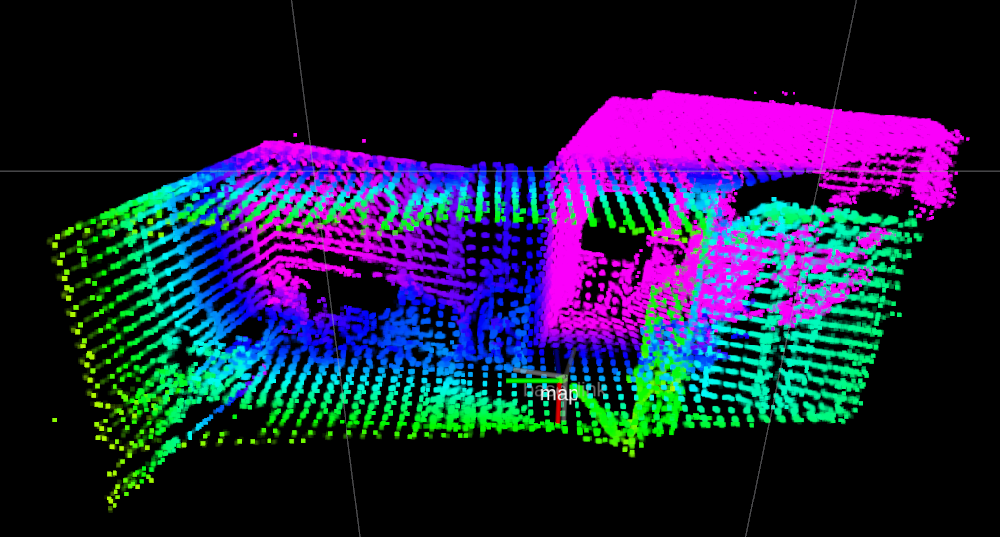
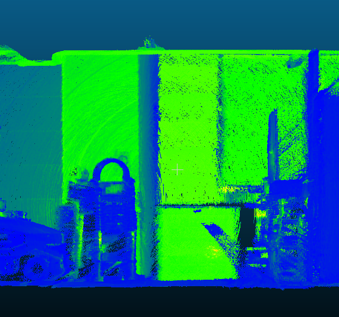
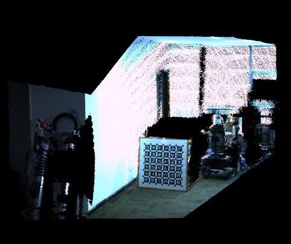

# extended_lidar_camera_calib

This work is an extended version of [livox_camera_calib](https://github.com/hku-mars/livox_camera_calib.git), which is suitable for spinning LiDAR. This README was built from the Oringial_README.md present in the same folder.

In order to apply this algorithm on spinning LIDAR(e.g:VLP16)， I add the preprocess process([FLOAM](https://github.com/wh200720041/floam.git)) to make the point cloud of the spinning LiDAR denser.

## Data Prepare

When you calibrate the spinning lidar and camera, record the data by holding the device(lidar and camera) stationary for a period of time and then slowly and repeatedly move the entire device in this direction to accumulate the point cloud.

## Dependency
```
ceres-slover == 1.14.0
pcl==1.8.0
```

## Context You'l need to know
1. This repo simply links to two completely separate libraries FLOAM and LIVOX
2. Pleas take a look at those two repos(folders here) individually to understand better

## Setup
1. Pull the Necessary Docker from DockerHub : sushanthj/lidar_camera_extrinsics_cailb:latest
2. Create a folder and name it 'input_bags'
3. At same directory as input_bags do ```git clone https://github.com/sushanthj/extended_lidar_camera_calib.git```
4. The above step will create a 'catkin_ws' folder which will be referenced by the docker

Now, modify the contents of run_docker.sh with the correct paths

## Run
1. Start the docker container by running ./run_docker.sh
2. Go to the catkin_ws and run catkin_make

If any dependencies are missing you can run the setup script inside the docker.

# Step 1: SLAM to accumulate dense pointcloud

**Note:** If you are using a VLP16 LIDAR, please start the robot and move it slowly forward for around 10 metres and then backward to start position.
This rosbag will be huge, but is required to accumulate a dense pointcloud.

Setup:
- Modify ```extended_lidar_camera_calib/floam/launch/floam_mapping.launch``` by giving the right path to the bag file
- If any other LIDAR than a VLP16 is being used, please make the necessary changes in the launch file
- Finally run ```roslaunch floam floam_mapping.launch```

This floam_mapping is because there are a few options. If using a VLP16
I think the following should be done:
1. Create a folder called /dataset within the floam folder
2. Put your rosbags there
3. Go to the floam_mapping.launch file and change the path to the rosbag
4. (optional if map.pcd is not saved later) In the same launch file, also change the ```map_save_ROOT``` parameter
5. Run the floam node: ```roslaunch floam floam_mapping.launch```
6. The node does not exit on it's own. But just do CTRL-C and it should save the map smoothly

# Step 2 : Lidar camera calibration

**NOTE:** The intrinsics **must be** accurate. Even slightly inaccurate extrinsics should not
affect the calibration.

Setup:
- Run the rosbag (at 0.05x rate) used for floam and open rqt_image_view. Save a frame (when the robot is static) from rqt as a .png in the ```extended_lidar_camera_calib/floam/PCD``` folder
- The same 'PCD' folder might should also have the floam's output (default name will be _map.pcd)
- In the ```extended_lidar_camera_calib/livox_camera_calib/config/calib.yaml``` add the correct image_file, pcd_file, and result_file paths
- In the same calib.yaml file, also set the camera intrinsics and distortion coefficients
- In another file called ```calib_indoor.yaml``` you will need to input an approximate extrinsics
- Note here that camera->lidar is the transform required

Finally run the below command:
```
roslaunch livox_camera_calib calib.launch
```

## Default Results (as per original repo)
They get better results in indoor enviroment. 
```
LIDAR : Robosense RS-Bpearl
Camera: MindVision MV-SUA133GC-T
```
slam result:
<p align='center'>

</p>

map result:
<p align='center'>

</p>

calib result:
<p align='center'>

</p>

